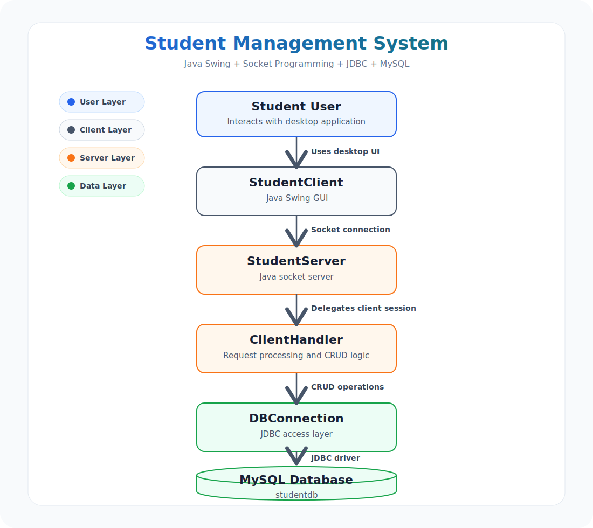

# System Architecture

This diagram shows the high-level architecture of the Java Student Management System. It is safe for public documentation and intentionally excludes usernames, passwords, connection strings, and other sensitive configuration details.

## Component Responsibilities

| Component | Responsibility |
| --- | --- |
| Student User | Uses the desktop application to manage student records. |
| StudentClient | Provides the Java Swing graphical user interface and sends requests to the server. |
| StudentServer | Listens for incoming socket connections and delegates each client session. |
| ClientHandler | Processes client commands and coordinates database operations. |
| DBConnection | Provides JDBC-based access to the database layer. |
| MySQL Database | Stores student records in the `studentdb` database. |

## Request Flow

1. The student user interacts with the Java Swing interface.
2. `StudentClient` sends the selected operation through a socket connection.
3. `StudentServer` accepts the connection and passes it to `ClientHandler`.
4. `ClientHandler` processes the request and uses `DBConnection` for database access.
5. `DBConnection` communicates with the MySQL database through JDBC.
